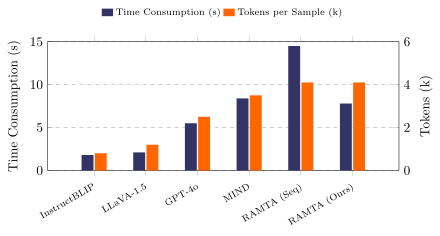

# Retrieving Precedents, Adapting Tool Plans, and Revising Judgments: Case-Based Reasoning for Zero-shot Harmful Meme Detection

This repository contains code, datasets, and prompts related to the paper titled "Retrieving Precedents, Adapting Tool Plans, and Revising Judgments: Case-Based Reasoning for Zero-shot Harmful Meme Detection". 

## Keywords

CBR, RAG, Harmful Meme Detection, LLM Agents, Tool Adaptation

## Repository Structure

- `framework/`: This directory contains the codebase for implementing / evaluating RAMTA.
- `data/`: This directory contains datasets utilized / generated in the experiments mentioned in the paper.
- `results/`: This directory contains the main experimental results for RAMTA.
- `utils/`: This directory contains utility scripts and supporting resources, including prompt templates and data processing helpers.
- `README.md`: This file provides an overview of the repository.
## Prompts
All detailed prompt templates are available in `utils/prompts.py` and `framework/prompts.py`.

## Efficiency Analysis

A common concern for applying case-based reasoning in emerging multimodal moderation settings is whether the additional stages of retrieval, adaptation, and revision introduce prohibitive latency and computational cost. To assess the practical viability of RAMTA as an application-oriented CBR system, we evaluate its inference efficiency against representative baselines. The Figure reports the average **time consumption** (seconds) and **token consumption** (thousands of tokens) per sample on the HarM dataset using a single NVIDIA RTX 4090.

**Efficiency of CBR-Guided Reuse and Parallel Adaptation.** Single-pass direct inference models (e.g., InstructBLIP and LLaVA-1.5) are naturally fast (<= 2.1s) and token-efficient (<= 1.2k), but they often fail to resolve culture-dependent or context-heavy harmful memes. GPT-4o (CoT achieves moderate latency (5.5s) and token usage (2.5k), yet still lacks explicit precedent reuse and structured conflict resolution. Multi-agent frameworks generally incur higher overhead; for example, MIND requires 8.4s and 3.5k tokens per sample.

RAMTA controls this overhead through two CBR-compatible design choices. First, retrieved cases provide prior guidance for adaptation, reducing verbose unguided reasoning and keeping token usage bounded at 4.1k. Second, the selected tools are executed asynchronously, reducing latency from 14.5s in the sequential setting to 7.8s in the parallel version. These results show that explicit case-guided reuse does not make the system impractical; rather, it helps structure downstream reasoning while maintaining competitive efficiency.

Overall, although RAMTA performs a three-stage CBR-inspired reasoning process, it remains efficient in practice and slightly outperforms MIND in latency (7.8s vs. 8.4s). This suggests that explicit retrieval, adaptive reuse, and revision can be incorporated into an emerging harmful meme detection application without incurring prohibitive deployment cost.

<p align="center">
  
</p>
<p align="center"><em>Figure. Efficiency comparison on the HarM dataset.</em></p>


## Quick Start

1. Prepare the datasets.  
   Please obtain FHM, HarM, and MAMI, and place them in the following directories:

```text
MIND/
├── data/
│   ├── FHM/
│   │   ├── images/
│   │   │   └── ...
│   │   ├── test.jsonl
│   │   └── train.jsonl
│   ├── HarM/
│   │   ├── images/
│   │   │   └── ...
│   │   ├── test.jsonl
│   │   └── train.jsonl
│   └── MAMI/
│       ├── images/
│       │   └── ...
│       ├── test.jsonl
│       └── train.jsonl
└── ...
```
2. Configure the API.  
   Open `config.py` and set your API key, API base URL, and default model.

3. Run the framework.

```bash
python framework/run_framework.py --mode main --dataset FHM --model gemini-flash
```

For more implementation details, please refer to `framework/README.md`.
